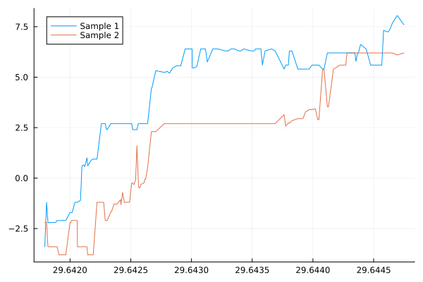
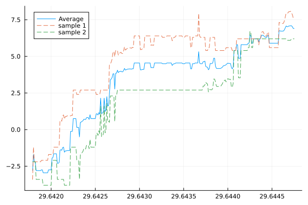
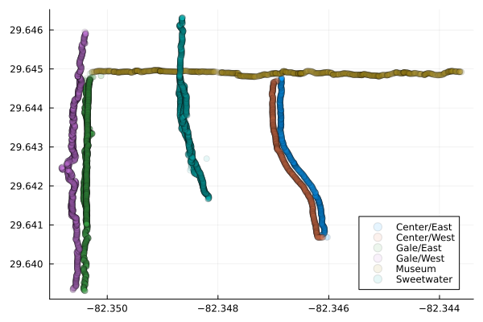

# NA-FinalProject

## Datatools

I spent a good amount of time understanding the data and how to process it. To make it so you don't have to do the same, I've developed some functions to speed up process. In order to use the functions I've made, simply use

```julia
include("path/to/datatools.jl")

```

For example, if I was working in the src/cubic_1d folder, datatools.jl would be located two directories back

```julia
include("../../datatools.jl")
```

This isn't the cleanest solution ever, but it should work for our project

Every function created in the file has a docstring, which should allow you to use `?FUNCTION_NAME` to figure out how to use it.


## Function demos

#### `get_folder_dataframes(foldername::String)`
This automatically looks for files contained within data/ , so no need to input weird filepaths. Simply input a string for the folder or subfolder. 
**Note:** This only works if all the files contained are CSVs, and it is indiscriminant towards which CSVs it grabs, so only include the Location.csv files exported by `Sensor Logger` in the data folders

This will return a vector of dataframes, one for each CSV file in the folder.

```julia

left_centerdr_dfs = get_folder_dataframes("Center/Left")
sweetwater_dfs = get_folder_dataframes("Sweetwater")

```

I've refrained from having every function just take in a folder name and then complete all the operations needed from that point. I've done this because each dataset may require a bunch of manipulations / need to exist in different forms, which may be lost otherwise.

---

#### `filter_matching_rows(dfs::Vector{Any}, column_name::String="latitude"; round_to::Int=5)`

For some of our comparisons, we will want all the dataframes in the vector to contain datapoints gathered at the same coordinates. This function goes through a specified column (latitude by default) and will keep rows in the different dataframes that have similar values. Note that this does not guarantee that the resulting dataframes will be the same size. For example. Say dataframe 1 `df1` has a column (say latitudes) with values  `[1.0, 1.0, 1.2, 1.3, 1.4]` and `df2`'s column is `[1.0, 1.2, 1.5, 1.6]`

`df1`'s column will now look like `[1.0, 1.0, 1.2]` while `df2`'s looks like `[1.0, 1.2]`

The numbers contained in each are all the same, but the vectors are of different sizes. Two points may be recorded as having the 'same' latitude. But why does this occur?

The sensors in this app are incredibly sensitive. They measure your distance down to 8 or 9 decimal places. If we wanted to average points based on latitude, or compare points at the same latitude, we'd pretty much have no common points, the locations are too precise. The locations get rounded by default in this function to 5 decimal places and compared from that state. This value can be adjusted, but I've found this to be a nice sweetspot of retaining precision and still getting a lot of matching data points. 


```julia
sweetwater_filtered_dfs = filter_matching_rows(sweetwater_dfs, "latitude")
```

 
---

#### `get_filtered_points(dfs::Vector{Any}, column_name::String="latitude"; round_to::Int=5, only_unique::Bool=true)`

This is similar to the last function, but setting `only_unique=true` removes the issues of different dataframe sizes. This also trims the dataframes to only contain the columns "latitude", "longitude" and "altitude". These are the only ones really necessary for plotting (I think?). It also sorts the dataframes based on the provided column, which is nice for comparing samples. Imagine recording data for the same road, but on one trip you walk south, and the other you walk north. The exported data will be reversed for the two.

```julia
sweetwater_df_points = get_filtered_points(sweetwater_dfs, "latitude")
```

I prefer working with the data as separate dataframes, I like the freedom I have to apply different plot attributes to it / work on the different samples individually. Sometimes, however, it can be easier instead to visualize the data as a single larger dataframe instead of multiple smaller ones.

---

#### `stack_df_vectors(dfs::Vector{Any})`
This stacks all the dataframes in a vector into one. It also adds a new column to the dataframe titled `sample`. Items coming from the first vector will be labeled as 'sample 1', items from the second will be 'sample 2', and the pattern repeats for every index of the original vector. This allows for some simple but quick plotting

*I'm using the filtered points here but you don't have to*

```julia
sweetwater_single_filtered_df = stack_df_vectors(sweetwater_df_points)

# I don't feel like typing that var name a bunch of times
ssfd = sweetwater_single_filtered_df

plot(ssfd.latitude, ssfd.altitude, group=ssfd.sample)
```


This automatically finds all the rows that belong to Sample1 and Sample2 and plots them on the same diagram

---

#### `combine_df_vectors(dfs::Vector{Any}; already_filtered::Bool=true, round_to::Int=5)`

Ultimately we will need to combine our samples in one, averaged collection. This function hopefully solves that. It assumes that you are passing in the vector of dataframes returned by `get_filtered_points` , but setting `already_filtered=false`
will call that function if you are not. 

```julia
sweetwater_dfs = get_folder_dataframes("Sweetwater");

filtered_sw_points = get_filtered_points(sweetwater_dfs);

sw_points = combine_df_vectors(filtered_sw_points)

## alternatively
sw_points = combine_df_vectors(sweetwater_dfs; already_filtered=false)

plt = plot(sw_points.latitude, sw_points.altitude, label="Average")
plot!(filtered_sw_points[1].latitude, filtered_sw_points[1].altitude, label="sample 1", ls=:dash)
plot!(filtered_sw_points[2].latitude, filtered_sw_points[2].altitude, label="sample 2", ls=:dash)
```


---

#### `get_spaced_nodes(x, y, n=10; fluctuation::Int=0)`

Takes in a set of x and y values and returns 'n' number of equally spaced nodes. By 'equally spaced', I mean that it is sampling equally spaced indices. If your data has 100 samples, and you want 10 points from it, it returns points from the indices [1, 10, 20, 30 ... , 100] (or at least close to that) .  You can create a bit of randomness by adjusting the values of fluctuation. This causes the indices to be shifted by some value in the range [-fluctuation, fluctuation]

---

#### `get_all_dataframes()`

** **SUPER USEFUL** ** . This is probably going to be the function you use in almost every file. It creates a Dictionary filled with dataframes from all the streets we've collected data from. The keys of the dictionary are the street names, and the values are vectors of dataframes, where each item within a vector is a dataframe representing one sample from that street. 

```julia
     all_dfs = get_all_dataframes()
```
     Dict{Any, Any} with 6 entries:

     "Gale/West"   => Any[1011×11 DataFrame…
     "Gale/East"   => Any[1383×11 DataFrame…
     "Museum"      => Any[1404×11 DataFrame…
     "Center/West" => Any[1029×11 DataFrame…
     "Sweetwater"  => Any[790×11 DataFrame…
     "Center/East" => Any[976×11 DataFrame…


To access the data from a given street:
```julia
     gale_east_dataframes = all_dfs["Gale/East"]
```

Combine this with `stack_df_vectors` from above to easily get dataframes for a given street

---

#### `stack_all_streets(dict::Dict{Any, Any})`
This is really only needed for applications in which you want to handle all of our data at once. This takes in the dictionary returned by `get_all_dataframes` and stacks them into one. It adds another column `street` to further delimit the data

```julia
     all_dfs = get_all_dataframes()
     df = stack_all_streets(all_dfs)
     scatter(df.longitude, df.altitude, group=df.street)
```

